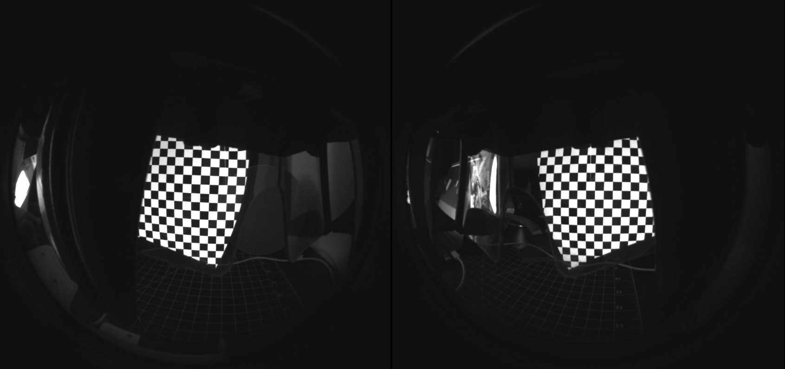

# 2D Optical Calibration


These Modules require python 3 in order to work


## Setup

1. Download the **Feat-Gen-2-software** branch of the following repo: [https://github.com/BryanChrisBrown/ProjectNorthStar/tree/feat-gen-2-software](https://github.com/BryanChrisBrown/ProjectNorthStar/tree/feat-gen-2-software)
2. Setup python with the following dependencies:  1\) Pyrealsense2 2\) OpenCV2 3\) Numpy
3. Print the calibration stand and [intel realsense mount](https://drive.google.com/file/d/1emnKXaevUyY_jEExWeCeesK_AUDbetcu/view?usp=sharing), the mount is friction based and requires no screws outside of the two m5 screws to mount the t265 itself.

## Calibrating your headset

Run through the following steps to calibrate your headset. 

* **captureGraycodes.py**
* Ensure that your headset is placed on the calibration stand, with the stand's camera looking through it where the users' eyes will be.
* Additionally ensure that your headset is plugged in and displaying imagery from your desktop.
* It helps to place a piece of cloth over the rig to shield the cameras + headset from ambient light.
* Running this script will display a sequence of graycodes on your North Star, capturing them at the same time.
* The sequence of binary codes will culminate in a 0-1 UV mapping, saved to **"./WidthCalibration.png""./HeightCalibration.png"** in your main folder.
* **calibrateGraycodes.py**
* Running this script will fit a 3rd-Degree 2D Polynomial to the left and right "eye"'s X and Y distortions.
* This polynomial will map from each display's 0-1 UV Coordinates to rectilinear coordinates \(where a 3D ray direction is just \(x, y, 1.0\)\).

When you are finished, you may paste the output of the calibrateGraycodes.py into [this diagnostic shadertoy](https://www.shadertoy.com/view/wsscD4) to check for alignment.

Additionally, there should be a `NorthStarCalibration.json` in this directory which you may use in the Unity implementation.

