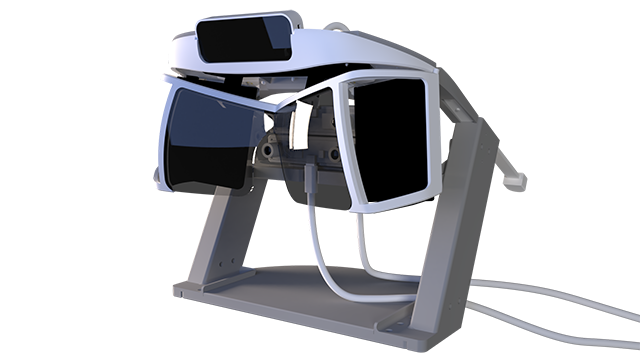

# Project North Star : Mechanical

This folder contains the mechanical assets necessary to build a Project North Star AR Headset with calibration stand. Mechanical Release 3 bundles together all the lessons we learned into a new set of 3D files and drawings. Its principle objective is to be more inviting, less hacked together, and more reliable. The design includes more adjustments and mechanisms for a larger variety of heads and facial geometries. Overall, the assembly is lighter, more balanced, and stiffer.

```text
!!! WARNING: This is a work in progress. This is not a finished guide, nor end-user friendly. 
Major sections are missing. Assembly requires care and patience. Nothing worth having is ever easy.
```



## Getting Started

Open “Assm Drawing North Star.pdf” and construct each sub-assembly as illustrated. A full list of the parts needed can be found in the Bill of Materials \(BOM\) files, which can be imported into spreadsheet software for easier viewing. Not all sub-assemblies are required as there are multiple designs to choose from. Furthermore, the CAD files are included in STEP format to help design new parts.

## Design Overview

The headset consists of two basic sections: the optics \#100-000 and headgear \#200-000. The optics subassembly currently has two variants: Release 3 optics and Update 3.1 \(i.e. the simplified optics assembly\). The headgear assembly utilizes the rear adjustment mechanism from a Miller branded welder’s helmet, but several models can be made to work.


### Optics assembly: Release 3 vs 3.1

Functionally, the two optics assemblies are the same. Release 3 is closer to the original design aesthetic and it’s marginally \(8g\) more lightweight. On the other hand, Update 3.1 halves the print time by removing the need for supports on the sides. Overall, the simplified 3.1 bracket is easier to print with lower print failures and stiffer too. It’s recommended to start with the simplified Release 3.1 optics assembly for the first build. See drawing \#100-000 in the assembly PDF for more information.


## Notes on 3D printed parts

* The parts were designed for a FDM style 3D printer
* All development was done using eSun's PLA Pro \(PLA+\) filament. We've found it to be strong, easy to print, and have great surface finish.
* A build plate of approximately 250x200mm is recommended for the largest parts 
* Parts may need to be rotated to align with print bed.
* Some parts have optimized versions \(labeled “FDM OPTIMIZED”\) with extra plastic tabs that need removing. These versions aid in minimizing warping and gripping the print surface.

```text
.25mm layer height, 2 perimeter shells, 15% infill
Filament: eSun PLA Pro (PLA+)
3D Printer: MakerGear M2
Slicer: Simplify 3D
```

### Installing heat set inserts

Several parts in the optics assembly use brass inserts for increased clamping load and the ability to swap out the components multiple times without wear. These inserts need to be heated above the plastic's melting point and pressed into the plastic. It's recommended to use an installation tip designed for brass inserts.

* [Installing inserts using soldering iron](https://www.youtube.com/watch?v=lFKuMkkYd44) - Demonstration of using a soldering iron to install brass inserts. The wire cutters are used to prevent the insert from pulling back out when not using an installation tip.

Parts that require inserts:

```text
Display trays (4 inserts each) - #111-00x and #112-00x
Driver board mount (2 inserts) - #121-001/#131-001
```

Installing brass inserts into the optics bracket is optional. They're intended as mounting points for future testing.

### Bending thermoplastics

The headgear assembly includes parts that print flat but bend to fasten to each other. Although not necessary, it’s suggested to drape these parts around a form while the 3D print is still soft from the heated print bed. This minimizes strain inside the plastic and prolongs the life of the part.

* [Example using mannequin head](https://www.youtube.com/watch?v=rDvcU_RxaM8) - Preheating the print bed to 70C softens a print enough to shape the part


## Additional Resources

* Join the community discussion on [Discord](https://discord.gg/NghjdX7)
* Scroll through the latest posts on [Reddit](https://www.reddit.com/r/ProjectNorthStar/)
* Keep up with our latest updates [Leap Motion Blog](http://blog.leapmotion.com/)

